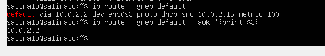
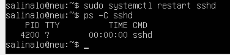
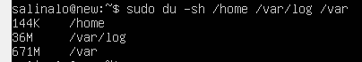

# Операционные системы UNIX/Linux. Работа с Ubuntu 20.04 Server LTS

 Основы администрирования. Работа на операционной системе Linux.

## Part 1. Установка ОС

Скачать Ubuntu 20.04 Server LTS с сайта https://old-releases.ubuntu.com/releases/20.04/.

Запустить VirtualBox, создать новую виртуальную ОС ubuntu и настроить ее. 

Узнать версию установленной ОС, выполнив команду `cat /etc/issue`.

>Разультат работы команды `cat /etc/issue`.

## Часть 2. Создание пользователя

Создание нового пользователя в группе adm

>Вызов команды для создания пользователя.

>Разультат работы команды `cat /etc/passwd`.

## Часть 3. Настройка сети ОС

Задать название машины вида user-1
Установить временную зону, соответствующую вашему текущему местоположению.
Вывести названия сетевых интерфейсов с помощью консольной команды.

>Вызовы команд для переименования машины, установки временной зоны, вывода названий сетевых интерфейсов.

>Вызовы команд для проверки переименованности машины, корректной временной зоны

`lo` - loopback interface - это виртуальный сетевой интерфейс, который компьютер использует для связи с самим собой при работе серверных приложений.

Используя консольную команду получить ip адрес устройства, на котором вы работаете, от DHCP сервера.

>Вызов команды для получения ip адреса текущего устройства от DHCP-сервера.

`DHCP` - Dynamic Host Configuration Protocol  - протокол динамической настройки узла. Сетевой протокол, позволяющий сетевым устройствам автоматически получать IP-адрес и другие параметры, необходимые для работы в сети IP.

Определить и вывести на экран внешний ip-адрес шлюза (ip) и внутренний IP-адрес шлюза, он же ip-адрес по умолчанию (gw).

>Вызов команды для определения внешнего ip-адреса шлюза.

>Вызов команды для определения внутреннего ip-адреса шлюза.

Задать статичные (заданные вручную, а не полученные от DHCP сервера) настройки ip, gw, dns (использовать публичный DNS серверы, например 1.1.1.1 или 8.8.8.8).

>Для изменения настроек вводим команду `sudo vim /etc/netplan/00-installer-config.yaml`, отключаем dhcp и добавляем адреса. 

Перезагрузить виртуальную машину. Убедиться, что статичные сетевые настройки (ip, gw, dns) соответствуют заданным в предыдущем пункте.

>Вызов команды для перезагрузки.

>Пинг хостов.

## Часть 4. Обновление ОС

Обновить системные пакеты до последней на момент выполнения задания версии.
    sudo apt update
    sudo apt upgrade

>Вызов команды обновления повторно, для подтверждения отсутствия обновления.

## Часть 5. Использование команды **sudo**

Разрешить пользователю, созданному в [Часть 2](#часть-2-создание-пользователя), выполнять команду sudo.

`sudo` - Super User DO - позволяет строго определенным пользователям выполнять команды с правами администратора.

Поменять hostname ОС от имени пользователя, созданного в пункте [Часть 2](#часть-2-создание-пользователя) (используя sudo).

>Разрешение позьзователю выполнять команду sudo, создание пароля ранее созданному пользователю и вызов команды для переименования машины.

## Часть 6. Установка и настройка службы времени

- Настроить службу автоматической синхронизации времени.
    sudo apt install ntpdate
    sudo ntpdate -qu 1.ro.pool.ntp.org

>Вызов команды для вывода времени и часового пояса.

## Часть 7. Установка и использование текстовых редакторов 

Установить текстовой редактор VIM, NANO, MCEDIT.

>Вызов команд установки трех текстовых редакторов VIM, NANO, MCEDIT.

Cоздать файл *testVim.txt*. Написать в нём свой никнейм, закрыть файл с сохранением изменений.

>Вызов команд для создания текстового файла `touch testVim.txt` и его открытия в текстовом редакторе VIM `vim testVim.txt`.
      

>Cодержимое файла testVim.txt перед закрытием. Для редактирования файла нажать `i`. После ввода текста `esc`. Для выхода с сохранением изменений `:wq` или `ZZ`.

Отредактировать файл, заменив никнейм на строку "21 School 21", закрыть файл без сохранения изменений

>Cодержимое файла testVim.txt после редактирования. Редактирование файла: удаляем первую строку `dd`, затем входим в режим редактирования `i`, набираем текст. После редактирования `esc`. Для выхода без сохранениния изменений `:q!`.

Поиск по содержимому файла.

>Результаты поиска слова. Поиск осуществляется через команду `/<find_text>`.

Замена слова на любое другое.

>Команда для замены слова на другое `:s/<find_text>/<replace_text>`.

Cоздать файл *test_nano.txt*. Написать в нём свой никнейм, закрыть файл с сохранением изменений.

>Вызов команд для создания текстового файла `touch test_nano.txt` и его открытия в текстовом редакторе NANO `vim test_nano.txt`

>Cодержимое файла test_nano.txt перед закрытием. Для редактирования вводить текст. Для выхода с сохранением изменений `control + x`, затем `y` и `enter`.

Отредактировать файл, заменив никнейм на строку "21 School 21", закрыть файл без сохранения изменений

>Cодержимое файла test_nano.txt после редактирования. Редактирование файла: удаляем первую строку, затем набираем текст. Для выхода без сохранениния изменений `control + x`, затем `n`.

Поиск по содержимому файла.

>Результаты поиска слова. Поиск осуществляется через нажатие `control + w` и ввода искомого слова, затем `enter`.

Замена слова на любое другое.

>Команда для замены слова на другое `control + \`, вводим искомое слово, затем `enter`, вводим замену, `enter`, и `y`.

Cоздать файл *test_mcedit.txt*. Написать в нём свой никнейм, закрыть файл с сохранением изменений.

>Вызов команд для создания текстового файла `touch test_mcedit.txt` и его открытия в текстовом редакторе NANO `mcedit test_mcedit.txt`

>Cодержимое файла test_mcedit.txt перед закрытием. Для редактирования вводить текст. Для выхода с сохранением изменений `esc` или `F10`, затем выбрать `Да`.

Отредактировать файл, заменив никнейм на строку "21 School 21", закрыть файл без сохранения изменений

>Cодержимое файла test_mcedit.txt после редактирования. Редактирование файла: удаляем первую строку, затем набираем текст. Для выхода без сохранениния изменений `esc` или `F10`, затем выбрать `Нет`.

Поиск по содержимому файла.

>Результаты поиска слова. Поиск осуществляется через нажатие `F7` и ввода искомого слова, затем `enter`, курсор должен находится перед искомым словом.

Замена слова на любое другое.

>Команда для замены слова на другое `F4`, вводим искомое слово, вводим зеамену, `enter`, и еще раз `enter`.

## Часть 8. Установка и базовая настройка сервиса **SSHD**

Установить службу SSHd.
    sudo apt update
    sudo apt install ssh
    sudo apt install openssh-server

Добавить автостарт службы при загрузке системы.
    

>Команда для автостарта `sudo systemctl enable ssh`

Перенастроить службу SSHd на порт 2022.
    sudo vim /etc/ssh/sshd_config

>Меняем *#Port 22* на *Port 2022*
    `sudo systemctl restart sshd`

Используя команду ps, показать наличие процесса sshd.

>Вызов команды для вывода процесса по его имени.

`ps` - команда, которая выводит статистику и информацию о состоянии процессов в системе, в том числе ИД процесса или нити, объем выполняемого ввода-вывода и используемый объем ресурсов процессора и памяти. \
Список ключей: \
-A, -e, (a) - выбрать все процессы; \
-a - выбрать все процессы, кроме фоновых; \
-d, (g) - выбрать все процессы, даже фоновые, кроме процессов сессий; \
-N - выбрать все процессы кроме указанных; \
-С - выбирать процессы по имени команды; \
-G - выбрать процессы по ID группы; \
-p, (p) - выбрать процессы PID; \
--ppid - выбрать процессы по PID родительского процесса; \
-s - выбрать процессы по ID сессии; \
-t, (t) - выбрать процессы по tty; \
-u, (U) - выбрать процессы пользователя.

Перезагрузить систему.
    sudo reboot

Вывод команды netstat -tan
    sudo apt install net-tools

>Вызов команды для вывода списка открытых портов и соответствующих им адресов, таблиц маршрутизации и скрытых соединений. \
Список ключей: \
-t - Отображение текущего подключения в состоянии переноса нагрузки с процессора на сетевой адаптер при передаче данных ( "offload" ); \
-a - Отображение всех подключений и ожидающих портов; \
-n - Отображение адресов и номеров портов в числовом формате.
`Proto` - Протокол, используемый сокетом.
`Recv-Q` - Счётчик байт не скопированных программой пользователя из этого сокета.
`Send-Q` - Счётчик байтов, не подтверждённых удалённым узлом.
`Local Address` - Адрес и номер порта локального конца сокета. Если не указана опция --numeric (-n), адрес сокета преобразуется в каноническое имя узла (FQDN), и номер порта преобразуется в соответствующее имя службы.
`Foreign Address` - Адрес и номер порта удалённого конца сокета. Аналогично "Local Address."
`State` - Состояние сокета.
`0.0.0.0` -  это немаршрутизируемый адрес IPv4, который используется в качестве адреса по умолчанию или адреса-заполнителя.

## Часть 9. Установка и использование утилит **top**, **htop**

Установить и запустить утилиты top. 
    top

>Вызов команды top. \
uptime - 59 min \
количество авторизованных пользователей - 1 \
общая загрузка системы - 0.00, 0.00, 0.00\
общее количество процессов - 109 \
загрузка cpu - 0.0 us, 0.1 sy, 0.0 ni, 99.9 id, 0.0 wa, 0.0 hi, 0.0 si, 0.0 st \
загрузка памяти - 2976.1 total, 234.3 free, 155.0 used, 456.8 buff/cache \
pid процесса занимающего больше всего памяти - 1\
pid процесса, занимающего больше всего процессорного времени - 1

Установить и запустить утилиты htop. 
    `htop`

>Вызов команды htop и сортировка по PID

>Cортировка по PERCENT_CPU

>Сортировка по PERCENT_MEM

>Сортировка по TIME

>Фильтр по sshd

>Поиск по syslog

>Добавлен вывод hostname, clock и uptime

## Часть 10. Использование утилиты **fdisk**

Запустить команду fdisk -l.
    sudo fdisk -l

>Вызов команды для получения информации о жёстком диске. \
Название жесткого диска - sda; \
Размер - 25Gib; \
Количество секторов - 52428800.

>Вызов команды для получения информации о размере swap на жёстком диске.

## Часть 11. Использование утилиты **df** 

Запустить команду df.

>Вызов команды для получения информации о дисковом пространстве. \
Размер раздела - 1992552; \
Размер занятого пространства - 110504; \
Размер свободного пространства - 1760808; \
Процент использования - 6;\
Единица измерения в выводе - 1K-blocks (килобайт).

Запустить команду df -Th.

>Вызов команды для получения информации о дисковом пространстве с типом файловой системы и размерами в читаемом виде. \
Размер раздела - 2.0G; \
Размер занятого пространства - 108M; \
Размер свободного пространства - 1.7G; \
Процент использования - 6;\
Тип файловой системы для раздела - ext4.

## Часть 12. Использование утилиты **du**

Запустить команду du.

>Вызов команды для получения информации о размере всех файлов в определённой папке

Вывести размер папок /home, /var, /var/log (в байтах, в человекочитаемом виде)

>Вызов команды для получения информации о размере папок /home, /var, /var/log в байтах.

>Вызов команды для получения информации о размере папок /home, /var, /var/log в человекочитаемом виде.

Вывести размер всего содержимого в /var/log (не общее, а каждого вложенного элемента, используя *)

>Вызов команды для получения информации о размере всего содержимого в /var/log в человекочитаемом виде.

## Часть 13. Установка и использование утилиты **ncdu**

Установить утилиту ncdu.
    sudo apt install ncdu

Вывести размер папок /home, /var, /var/log.

>Вызов команды для получения информации о размере папки /home.

>Вызов команды для получения информации о размере папки /var.

>Вызов команды для получения информации о размере папки /var/log.

## Часть 14. Работа с системными журналами

Открыть для просмотра /var/log/dmesg

>Вывод файла vim /var/log/dmesg

Открыть для просмотра /var/log/syslog

>Вывод файла vim /var/log/syslog

Открыть для просмотра /var/log/auth.log

>Вывод файла vim /var/log/auth.log
Время последней успешной авторизации - Aug 28 16:06:32;
Имя пользователя - gilderoa;
Метод входа в систему - pam_unix.

Перезапустить службу SSHd.
    sudo systemctl restart sshd

>Вывод файла /var/log/syslog с сообщением о рестарте службы SSHd.

## Часть 15. Использование планировщика заданий **CRON**

Используя планировщик заданий, запустите команду uptime через каждые 2 минуты.
    crontab -e

>Редактирование планировщика задач, путем добавления новой строки с текстом `*/2 * * * * uptime`.

Найти в системных журналах строчки (минимум две в заданном временном диапазоне) о выполнении.

>Вывод данных из файла /var/log/syslog со строками о выполнении запуска команды uptime через каждые 2 минуты.

Вывести на экран список текущих заданий для CRON.

>Вывод списка текущих заданий для CRON.

Удалить все задания из планировщика заданий.

>Удаление всех заданий планировщика и вывод списка текущих заданий для CRON.

